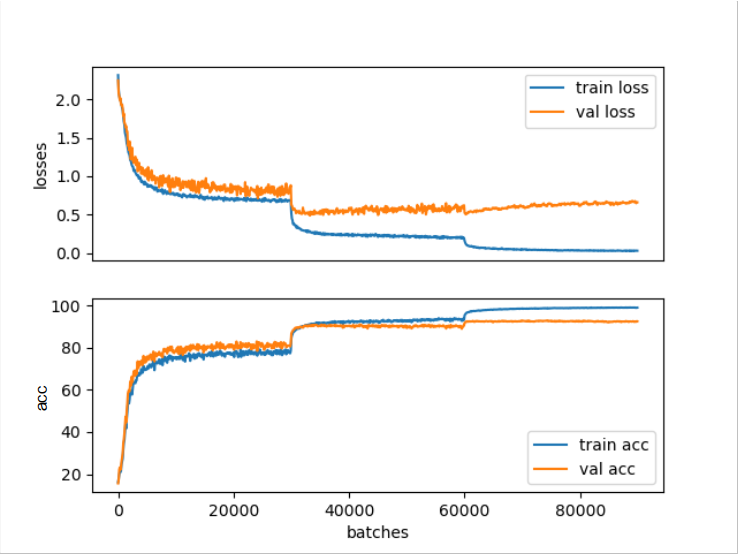

# Benchmarking VGG16 on CIFAR10

### Training Experiments with Different Hyper-parameters

|Number of epochs|Learning Rate|LR Scheduler                   |Batch Size|Preprocess                                                           |Data Augmentation Techniques     |Accuracy|Additional                    |
|----------------|-------------|-------------------------------|----------|---------------------------------------------------------------------|---------------------------------|--------|------------------------------|
|30              |0.0003       |None                           |4         |- Normalize with std=0.5, mean=0.5 for each channel                  |N/A                              |84.09%  |                              |
|60              |0.001        |None                           |4         |- Normalize with std=0.5, mean=0.5 for each channel                  |- Random cropping padding=4      |85.76%  |                              |
|                |             |                               |          |                                                                     |- Random horizontal flip prob=0.5|        |                              |
|                |             |                               |          |                                                                     |- Random rotation angle=45       |        |                              |
|120             |0.001        |None                           |4         |- Normalize with std=0.5, mean=0.5 for each channel                  |- Random cropping padding=4      |86.93%  |                              |
|                |             |                               |          |                                                                     |- Random horizontal flip prob=0.5|        |                              |
|                |             |                               |          |                                                                     |- Random rotation angle=45       |        |                              |
|100             |0.0005       |None                           |16        |- Normalize with std=0.5, mean=0.5 for each channel                  |- Random cropping padding=4      |86.44%  |                              |
|                |             |                               |          |                                                                     |- Random horizontal flip prob=0.5|        |                              |
|                |             |                               |          |                                                                     |- Random rotation angle=45       |        |                              |
|100             |0.01         |StepLR with step=1, gamma=0.95 |16        |-Normalize with std=(0.485, 0.456, 0.406), mean=(0.229, 0.224, 0.225)|- Random cropping padding=4      |87.35%  |                              |
|                |             |                               |          |                                                                     |- Random horizontal flip prob=0.5|        |                              |
|                |             |                               |          |                                                                     |- Random rotation angle=45       |        |                              |
|100             |0.01         |StepLR with step=1, gamma=0.95 |16        |-Normalize with std=(0.485, 0.456, 0.406), mean=(0.229, 0.224, 0.225)|- Random cropping padding=4      |87.13%  |- Add Dropout 0.3             |
|                |             |                               |          |                                                                     |- Random horizontal flip prob=0.5|        |                              |
|                |             |                               |          |                                                                     |- Random rotation angle=45       |        |                              |
|100             |0.01         |StepLR with step=1, gamma=0.95 |32        |-Normalize with std=(0.485, 0.456, 0.406), mean=(0.229, 0.224, 0.225)|- Random cropping padding=4      |87.45%  |                              |
|                |             |                               |          |                                                                     |- Random horizontal flip prob=0.5|        |                              |
|                |             |                               |          |                                                                     |- Random rotation angle=45       |        |                              |
|100             |0.01         |StepLR with step=1, gamma=0.95 |32        |-Normalize with std=(0.485, 0.456, 0.406), mean=(0.229, 0.224, 0.225)|- Random cropping padding=4      |87.43%  |- Add Dropout 0.3             |
|                |             |                               |          |                                                                     |- Random horizontal flip prob=0.5|        |                              |
|                |             |                               |          |                                                                     |- Random rotation angle=45       |        |                              |
|100             |0.01         |StepLR with step=1, gamma=0.95 |64        |-Normalize with std=(0.485, 0.456, 0.406), mean=(0.229, 0.224, 0.225)|- Random cropping padding=4      |87.00%  |- Add Dropout 0.3             |
|                |             |                               |          |                                                                     |- Random horizontal flip prob=0.5|        |                              |
|                |             |                               |          |                                                                     |- Random rotation angle=45       |        |                              |
|50              |0.01         |StepLR with step=1, gamma=0.95 |128       |-Normalize with std=(0.485, 0.456, 0.406), mean=(0.229, 0.224, 0.225)|- Random cropping padding=4      |88.32%  |- Add Dropout 0.3             |
|                |             |                               |          |                                                                     |- Random horizontal flip prob=0.5|        |                              |
|                |             |                               |          |                                                                     |- Random rotation angle=45       |        |                              |
|50              |0.01         |StepLR with step=1, gamma=0.95 |256       |-Normalize with std=(0.485, 0.456, 0.406), mean=(0.229, 0.224, 0.225)|- Random cropping padding=4      |87.91%  |- Add Dropout 0.3             |
|                |             |                               |          |                                                                     |- Random horizontal flip prob=0.5|        |                              |
|                |             |                               |          |                                                                     |- Random rotation angle=45       |        |                              |
|50              |0.01         |StepLR with step=1, gamma=0.95 |128       |-Normalize with std=(0.485, 0.456, 0.406), mean=(0.229, 0.224, 0.225)|- Random cropping padding=4      |88.85%  |- Add Dropout 0.3             |
|                |             |                               |          |                                                                     |- Random horizontal flip prob=0.5|        |- Add ReLU after fc1          |
|                |             |                               |          |                                                                     |- Random rotation angle=45       |        |                              |
|50              |0.01         |StepLR with step=1, gamma=0.95 |128       |-Normalize with std=(0.485, 0.456, 0.406), mean=(0.229, 0.224, 0.225)|- Random cropping padding=4      |88.86%  |- Add Dropout 0.3             |
|                |             |                               |          |                                                                     |- Random horizontal flip prob=0.5|        |- Add ReLU after fc1          |
|                |             |                               |          |                                                                     |- Random rotation angle=45       |        |- Add AvgPool2d               |
|300             |0.1          |StepLR with step=100, gamma=0.1|128       |-Normalize with std=(0.485, 0.456, 0.406), mean=(0.229, 0.224, 0.225)|- Random cropping padding=4      |90.32%  |- Add Dropout 0.3             |
|                |             |                               |          |                                                                     |- Random horizontal flip prob=0.5|        |- Add ReLU after fc1          |
|                |             |                               |          |                                                                     |- Random rotation angle=45       |        |- Add AvgPool2d               |
|300             |0.1          |StepLR with step=100, gamma=0.1|128       |-Normalize with std=(0.485, 0.456, 0.406), mean=(0.229, 0.224, 0.225)|- Random cropping padding=4      |92.84%  |- Add Dropout 0.3             |
|                |             |                               |          |                                                                     |- Random horizontal flip prob=0.5|        |- Add ReLU after fc1          |
|                |             |                               |          |                                                                     |- Random rotation angle=45       |        |- Add AvgPool2d               |
|                |             |                               |          |                                                                     |                                 |        |- Add weight decay=5e-4 to SGD|
|200             |0.1          |StepLR with step=50, gamma=0.1 |128       |-Normalize with std=(0.485, 0.456, 0.406), mean=(0.229, 0.224, 0.225)|- Random cropping padding=4      |91.93%  |- Add Dropout 0.3             |
|                |             |                               |          |                                                                     |- Random horizontal flip prob=0.5|        |- Add ReLU after fc1          |
|                |             |                               |          |                                                                     |- Random rotation angle=45       |        |- Add AvgPool2d               |
|                |             |                               |          |                                                                     |                                 |        |- Add weight decay=5e-4 to SGD|

### Graph From the Best Result of 92.84% Accuracy on the Test Set

### Reproducing
To reproduce the 92.84% accuracy model (or close to it), run

    pip3 install -r requirements.txt
    
    cd src/

    python3 train.py -e 300 -l 0.1 -b 128 -u 100 -d 0.0005 -s 100 -g 0.1